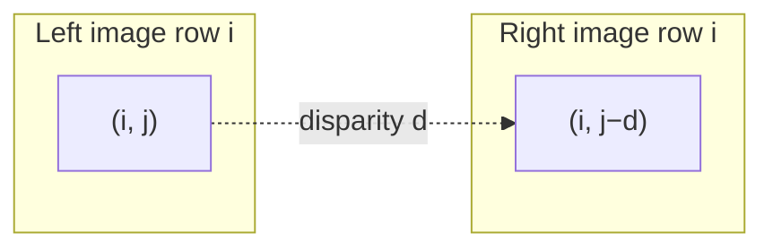
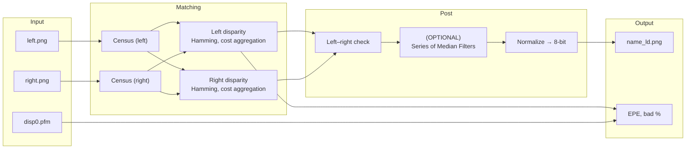
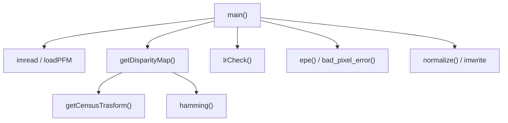
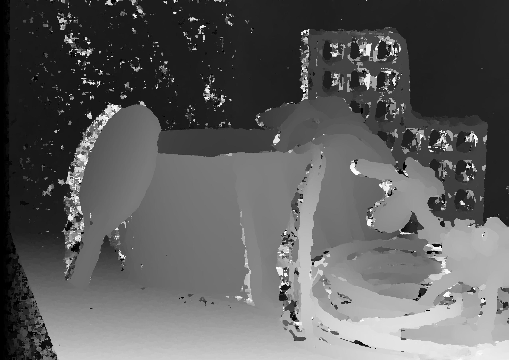
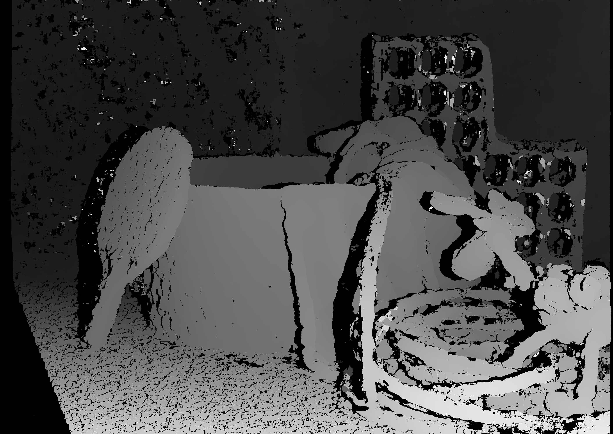
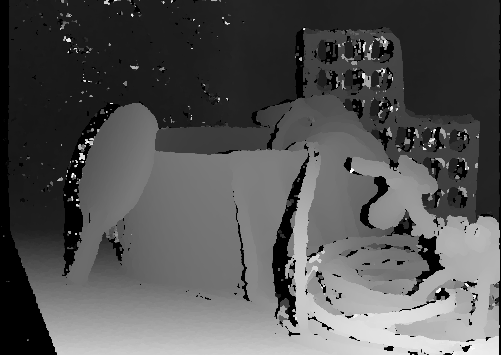
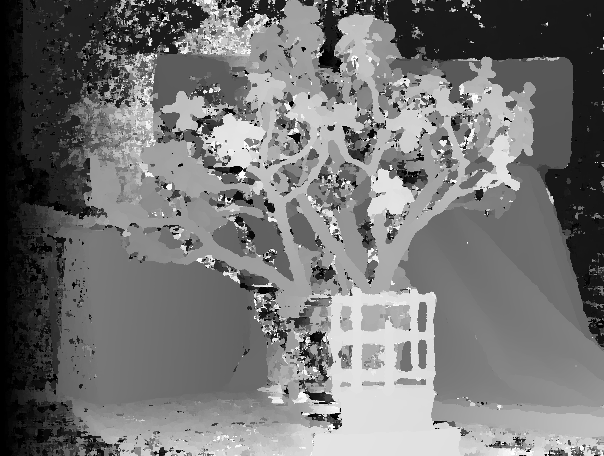
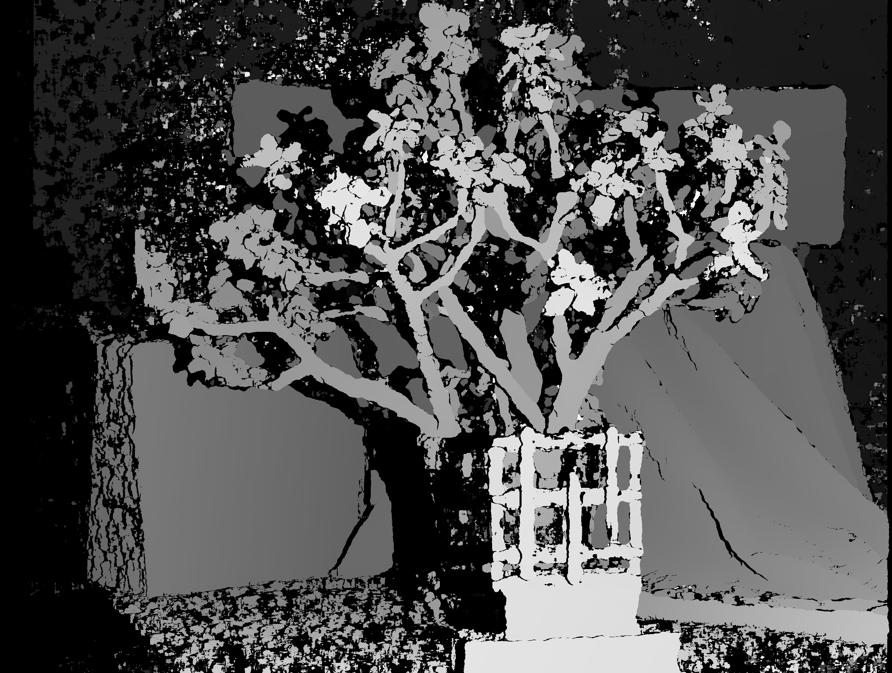
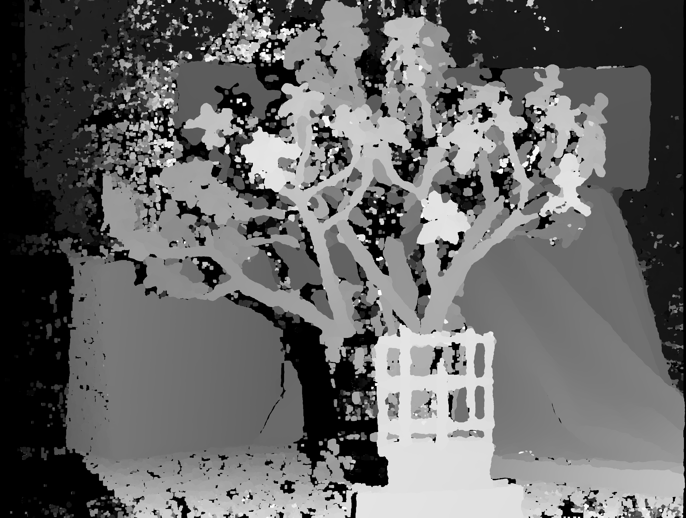

# Stereo Disparity Estimation — Project Presentation

---

## 1. Project description

### Task

Estimate a **disparity map** from a **stereo pair**: two grayscale images of the same scene taken from horizontally separated cameras (left and right). Disparity is the horizontal shift (in pixels) between corresponding points. From disparity, **depth** can be recovered when camera calibration is known.

The pipeline is **local stereo matching**: Census-transform descriptors, **Hamming** matching cost, cost aggregation in a sliding window, then **left–right consistency** to reject unreliable pixels. Results are compared to **ground-truth** disparity using **End-Point Error** and **Bad-Pixel** metrics.

### Terms


| Term                 | Meaning                                                                                                                      |
| -------------------- | ---------------------------------------------------------------------------------------------------------------------------- |
| **Stereo pair**      | Left and right images.                                                                                                       |
| **Disparity `d`**    | For a point in the reference view at column `j`, the match in the other view is at `j ± d` (sign depends on reference view). |
| **Disparity map**    | Per-pixel disparity values.                                                                                                  |
| **Depth `Z`**        | `Z = baseline × focal / (d + doffs)`                                                                                         |
| **Census transform** | Encodes local structure as a bit string: each bit compares center intensity to a neighbour.                                  |
| **Hamming distance** | Number of differing bits between two Census codes (`__popcnt64` on XOR).                                                     |
| **Occluded pixel**   | Visible in one view only; marked invalid (`-1`) after left–right check.                                                      |
| **EPE**              | End-point error: mean absolute disparity error on valid pixels.                                                              |
| **Bad pixel**        | Valid pixel where`                                                                                                           |


### Input / output


|                               | Description                                                                                        |
| ----------------------------- | -------------------------------------------------------------------------------------------------- |
| **Input**                     | `{name}_left.png`, `{name}_right.png` — 8-bit grayscale, same size, rectified stereo.              |
| **Ground truth** (evaluation) | `{name}_disp0.pfm` — Middlebury PFM disparity (invalid = inf or ≤ 0).                              |
| **Output**                    | `{name}_ld.png, {name}_rd.png` — normalized disparity visualization; console metrics (EPE, bad %). |


**Scene name** is set by the constant `FILE_NAME` (options: `"jade", "ping", "umbrella"`).

### Input constraints

- Images must be **grayscale** (`imread(..., 0)`).
- Left and right must have **identical width and height** (enforced in `getDisparityMap`).
- Stereo should be **rectified** (epipolar lines horizontal); the code only searches along rows.

---

## 2. Related work and references

### Other solutions


| Approach                       | Idea                                                                                                                                                                                                                                                                                                |
| ------------------------------ | --------------------------------------------------------------------------------------------------------------------------------------------------------------------------------------------------------------------------------------------------------------------------------------------------- |
| **Census / Hamming**           | Takes into account local structure of the image. Tries to match pixels in left and right images based on the relationship between the pixel and its neighbors (census transform) and then finding the minimum difference between 2 census codes of pixels from the 2 images using Hamming distance. |
| **Semi-Global Matching (SGM)** | Takes into account global structure of the image. It approximates a 2D smoothness optimization using multiple 1D path aggregations.                                                                                                                                                                 |


### Documentation and datasets used

- **Middlebury Stereo Evaluation** — test images and `.pfm` ground truth (`jade`, `ping`, `umbrella`): [https://vision.middlebury.edu/stereo/](https://vision.middlebury.edu/stereo/)
- **Census transform** — Zabih & Woodfill, *Non-parametric local transforms for computing visual correspondence*, ECCV 1994.

---

## 3. General approach and architecture

### Stereo correspondence (concept)

For **left** reference view (`DISP_TYPE::LEFT`), pixel `(i, j)` is matched to the right view at `(i, j − d)`:




### High-level pipeline




### Tunable parameters


| Parameter                                     | Description                                                                              | Value                                                                                          |
| --------------------------------------------- | ---------------------------------------------------------------------------------------- | ---------------------------------------------------------------------------------------------- |
| **FILE_NAME**: string                         | stereo pair                                                                              | **jade**; **ping**; **umbrella**                                                               |
| **MAX_DISPARITY**: int                        | upper bound for the disparity of a pixel -> used to iterate through possible disparities | **640**; **390**; **250**                                                                      |
| **NEIGH_SIZE: int -> in *getDisparityMap()*** | the neighbourhood size used to compute the census transform of a pixel                   | i used *long long* for storing the census codes so the maximum value is **3** => 48 neighbours |
| **r**: int -> in *getDisparityMap()*          | the size if the window used for cost aggregation => (2r + 1) *x* (2r + 1) window         | **15**                                                                                         |


### Module structure (code map)




**Optional helpers**`holeFill`, `medianFilter`, `transformDisparityMapToDepthMap`.

---

## 4. Implementation details

### 4.1 Census transform (`getCensusTrasform`)

For each pixel, compare the center to all neighbours in a `(2·NEIGH+1)²` window (here `NEIGH_SIZE = 3` → 7×7, **48 bits**). Image is padded with `BORDER_REFLECT_101`.

```text
censusPixel |= (center >= neighbour) ? (1 << k) : 0   for each neighbour k
```

### 4.2 Disparity estimation (`getDisparityMap`)

For each candidate disparity `d ∈ [0, MAX_DISPARITY)`:

1. **Matching cost** — Hamming distance between Census codes at corresponding columns.
2. **Window aggregate** — Mean cost in a **(2r+1)×(2r+1)** window (`r = 15` → 31×31).
3. **Final Disparity**— Keep `d` with minimum aggregated cost per pixel.

Pseudocode:

```text
best_cost ← +∞, disparity ← -1
for d = 0 .. MAX_DISPARITY-1:
    for each pixel (i,j):
        cost[i,j] ← Hamming(census_left[i,j], census_right[i, j_shift(d)])
    cost ← Partial_Sum_Matrix(cost)
    for each pixel (i,j):
        avg ← meanWindow(cost, i, j, r=15)
        if avg < best_cost[i,j]:
            best_cost[i,j] ← avg
            disparity[i,j] ← d
return disparity
```

`j_shift` for left view: `j - d`; for right view: `j + d`.

### 4.3 Left–right consistency (`lrCheck`)

A left disparity `d` at `(i,j)` is accepted only if the right disparity at `(i, j−d)` agrees within threshold `1`:

```text
if |d - right_disp(i, j-d)| > 1 → mark invalid (-1)
```

### 4.4 Ground truth and metrics

- **loadPFM** — reads Middlebury PFM, converts invalid (inf, ≤0) to `-1`.
- **EPE** — mean `|d_est − d_gt|` over pixels where both are valid.
- **Bad pixel %** — fraction with error `> 2`

### 4.5 Current `main` configuration

```cpp
const int MAX_DISPARITY = 640;
String FILE_NAME = "jade";
// ...
Mat_<int> left_disp  = getDisparityMap(right_img, left_img, LEFT);
Mat_<int> right_disp = getDisparityMap(left_img, right_img, RIGHT);
Mat_<int> hole_mark_ld = lrCheck(left_disp, right_disp);
Mat_<int> filtered_ld = medianFilter(medianFilter(hole_mark_ld, 5), 5);

float epe_err = epe(filtered_ld, left_disp_GT);
float bad_pixels_err = bad_pixel_error(filtered_ld, left_disp_GT);
```

### 4.6 Time complexity

**O(MAX_DISPARITY *x IMG_ROWS x IMG_COLS*)** -> for each possible disparity, we need to compute the hamming distance between each left image pixel`s census code and the census code of its corresponding pixel in the right image. The cost aggregation is done in **O(1)** because of the **Partial Sum Matrix.** 

---

## 5. User manual

### Prepare data

Place under `Images/` (or change `FILE_NAME`):


| Files        | Example (jade)   |
| ------------ | ---------------- |
| Left view    | `jade_left.png`  |
| Right view   | `jade_right.png` |
| Ground truth | `jade_disp0.pfm` |


Repeat naming for `ping`, `umbrella`, etc.

### Run

1. Optionally edit `FILE_NAME` in `OpenCVApplication.cpp` and rebuild.
2. Check console output and `Images\{name}_ld.png`.

### Switch test scene

Change line ~442:

```cpp
String FILE_NAME = "ping";   // or "umbrella", "jade"
```

Ensure matching `_left.png`, `_right.png`, and `_disp0.pfm` exist.

---

## 6. Demonstration and conclusions

### 6.1 Simple Case

**FILE_NAME** = ping

**MAX_DISPARITY** = 390


### Result without LR_CHECK without Mean Filters (no post processing)

The `occlusions` are also treated as valid pixels, receiving incorrect values. We can identify this on the disparity map as salt-and-pepper like noise. This will drastically affect the **EPE** score

| Result | Value |
|----------|------|
| **TOTAL PIXELS** | 5547264 |
| **GT VALID PIXELS** | 5438079 |
| **DISP VALID PIXELS** | 5438079 |
| **DISP COVERAGE** | `100.00%` |
| **REJECTED** | 0% |
| **BAD PIXEL PERCENTAGE (predictions only)** | `24.43%`  |
| **BAD PIXEL PERCENTAGE (all GT)** | `24.43%` |
| **MEAN EPE** | `17.36` |



### Result with LR_CHECK without Mean Filters

Only pixels that are identified in both left and right disparities map are kept. We can state with much more confidence that these pixels' disparities are identified correctly (we can see this also in the improvement in the **EPE**). The problem is that also some pixels which are not `occlusions`, but they have been classified improperly, maybe due to lighting/texture/color/camera imperfect angle are treated as `oclussions`/`invalid`, resulting in a worse **BAD PIXEL PERCENTAGE(all GT)**.

| Result | Value |
|----------|------|
| **TOTAL PIXELS** | 5547264 |
| **GT VALID PIXELS** | 5438079 |
| **DISP VALID PIXELS** | 4391966 |
| **DISP COVERAGE** | `80.76%` |
| **REJECTED** | 19.24% |
| **BAD PIXEL PERCENTAGE (predictions only)** | `11.92%` |
| **BAD PIXEL PERCENTAGE (all GT)** | `28.86%` |
| **MEAN EPE** | `4.02` |




### Result with LR_CHECK with 2 Mean Filters(5x5)
By applying mean filters the result will look smoother and with less *invalid pixels*. Also the mean filters help get rid of salt and pepper type noise in the disparity map. The **BAD PIXEL PERCENTAGE(all GT)** improves, but the **EPE** increases because *a)* filtering changes disparities of valid pixels. *b)* LR check removes difficult pixels, but
filtered version reintroduces harder pixels and also marks more GT occlusions as valid disparities.
| Result | Value |
|----------|------|
| **TOTAL PIXELS** | 5547264 |
| **GT VALID PIXELS** | 5438079 |
| **DISP VALID PIXELS** | 4939996 |
| **DISP COVERAGE** | `90.84%` |
| **REJECTED** | 9.16% |
| **BAD PIXEL PERCENTAGE (predictions only)** | `15.64%` |
| **BAD PIXEL PERCENTAGE (all GT)** | `23.37%` |
| **MEAN EPE** | `6.38` |





### 6.1 Difficult Case

**FILE_NAME** = jade

**MAX_DISPARITY** = 640


### Result without LR_CHECK without Mean Filters (no post processing)

| Result | Value |
|----------|------|
| **TOTAL PIXELS** | 5232416 |
| **GT VALID PIXELS** | 5106848 |
| **DISP VALID PIXELS** | 5106848 |
| **DISP COVERAGE** | `100.00%` |
| **REJECTED** | 0% |
| **BAD PIXEL PERCENTAGE (predictions only)** | `43.62%`  |
| **BAD PIXEL PERCENTAGE (all GT)** | `43.62%` |
| **MEAN EPE** | `53.64` |



### Result with LR_CHECK without Mean Filters

| Result | Value |
|----------|------|
| **TOTAL PIXELS** | 5232416 |
| **GT VALID PIXELS** | 5106848 |
| **DISP VALID PIXELS** |  3279900 |
| **DISP COVERAGE** | `64.23%` |
| **REJECTED** | 35.77% |
| **BAD PIXEL PERCENTAGE (predictions only)** | `19.73%` |
| **BAD PIXEL PERCENTAGE (all GT)** | `48.45%` |
| **MEAN EPE** | `20.63` |




### Result with LR_CHECK with 2 Mean Filters(5x5)

| Result | Value |
|----------|------|
| **TOTAL PIXELS** | 5232416 |
| **GT VALID PIXELS** | 5106848 |
| **DISP VALID PIXELS** | 4240512 |
| **DISP COVERAGE** | `83.04%` |
| **REJECTED** | 16.96% |
| **BAD PIXEL PERCENTAGE (predictions only)** | `31.56%` |
| **BAD PIXEL PERCENTAGE (all GT)** | `43.17%` |
| **MEAN EPE** | `37.32` |





### 6.3 Conclusions
1. LR consistency mainly improves confidence, not necessarily accuracy everywhere. It is not just removing wrong pixels — it is filtering the prediction space to high-confidence regions:
    - EPE drops massively after LR check
    - but coverage drops significantly

2. Filtering increases coverage at the cost of reintroducing uncertainty:
    - coverage increases
    - but EPE increases

3. Jade results show error amplification in high-disparity scenes. Also based on other test scenarios texture also have great influence on disparity map (worst case: objects with same color/texture/illumination everywhere -> disparity can become any pixel)
    - ping: EPE ~17 → 4
    - jade: EPE ~53 → 20

4. Filtering improves **visual quality** more than numerical accuracy